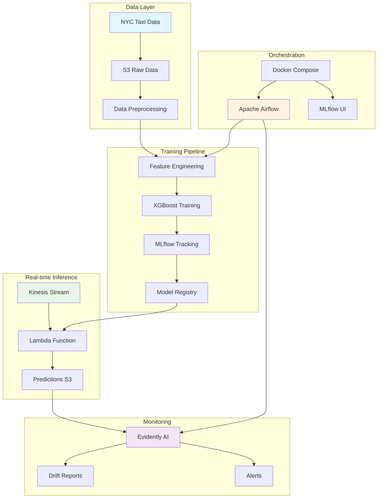
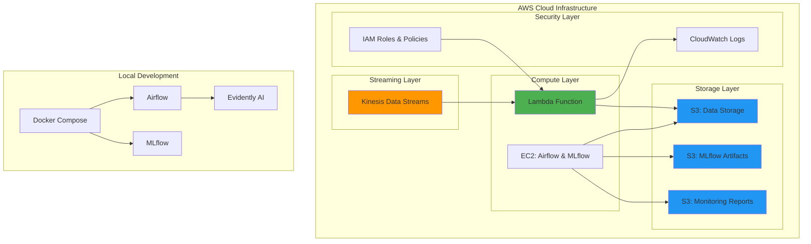
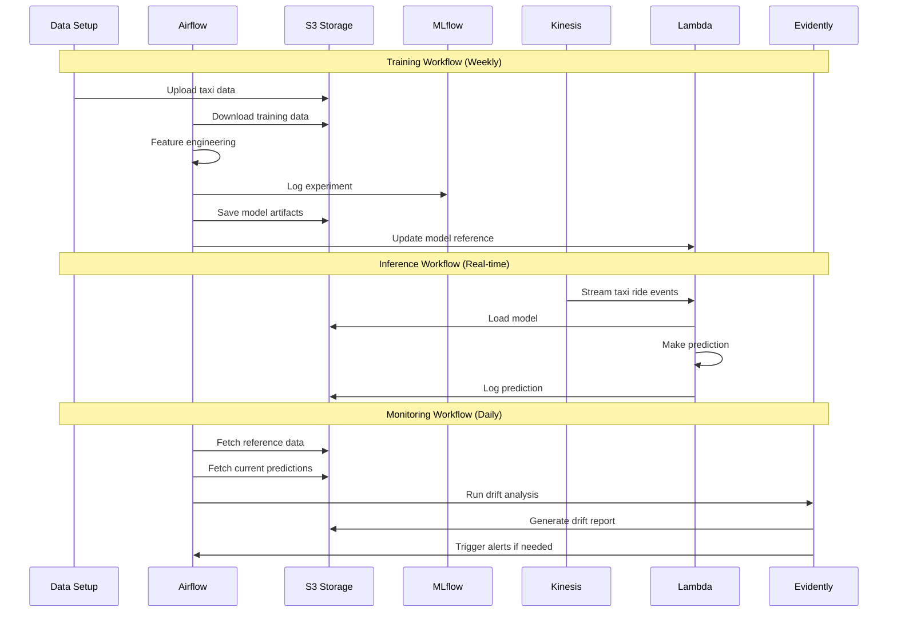

# NYC Taxi Trip Duration Prediction - MLOps Learning Project

A **personal learning project** for building an MLOps pipeline that predicts NYC taxi trip durations. This project emphasizes simplicity, cost-efficiency, and practical learning over enterprise-grade complexity.

## 📋 Project Status

**Infrastructure Complete - Ready for AWS Deployment**
- ✅ All Terraform modules defined and tested
- ✅ ECS Fargate task definitions for Airflow and MLflow
- ✅ Lambda deployment package created (392MB)
- ✅ Cost-optimized for ~$90-120/month

## 🏗️ Architecture Overview

```mermaid
graph TB
    subgraph "AWS Cloud Infrastructure"
        subgraph "Data Layer"
            S3A[S3: MLflow Artifacts]
            S3B[S3: Data Storage]
            S3C[S3: Monitoring Reports]
            EFS[EFS: Shared Storage]
        end
        
        subgraph "Compute Layer"
            ECS[ECS Fargate: Airflow + MLflow]
            Lambda[Lambda: Predictions]
            RDS[RDS PostgreSQL]
        end
        
        subgraph "Networking"
            ALB[Application Load Balancer]
            KDS[Kinesis Data Stream]
        end
        
        KDS -- Lambda
        Lambda -- S3B
        ECS -- RDS
        ECS -- S3A
        ECS -- S3B
        ECS -- S3C
        ECS -- EFS
        ALB -- ECS
    end
    
    style KDS fill:#ff9800
    style Lambda fill:#4caf50
    style ECS fill:#2196f3
```

## 🏗️ Architecture Overview



## 🏛️ Infrastructure Diagram



## 🔄 Functional Workflow



## 🚀 Quick Start

### Prerequisites

- Docker and Docker Compose
- AWS CLI configured with appropriate permissions
- Terraform >= 1.0
- Python 3.9+

### 1. Clone and Setup

```bash
git clone <repository-url>
cd mlops-pipeline

# Set up environment variables
cp .env.example .env
# Edit .env with your AWS credentials and preferences
```

### 2. Deploy Infrastructure

```bash
cd infra
terraform init
terraform plan
terraform apply

# Note the outputs for later configuration
terraform output
```

### 3. Deploying on AWS

```bash
cd ../infra
terraform apply

# This will setup all AWS infrastructure including ECS, RDS, and S3 buckets
```

### 4. Initialize Data and Test Pipeline

```bash
# Setup initial data
python scripts/data_setup.py

# Test end-to-end pipeline
python scripts/test_consumer.py

# Start event simulation (optional)
python scripts/event_simulation.py --max-events 100 --interval 2
```

### 5. Access Interfaces

- **Airflow UI**: http://localhost:8080 (admin/admin)
- **MLflow UI**: http://localhost:5000
- **Evidently Reports**: Check S3 monitoring bucket

## 📊 Technology Stack

| Component | Technology | Purpose |
|-----------|------------|----------|
| **Cloud Provider** | AWS | Infrastructure hosting |
| **Infrastructure as Code** | Terraform | Resource provisioning |
| **Streaming** | Kinesis Data Streams | Real-time data ingestion |
| **Serverless Compute** | AWS Lambda | Real-time inference |
| **Storage** | Amazon S3 | Data and artifact storage |
| **Orchestration** | Apache Airflow | Workflow management |
| **Experiment Tracking** | MLflow | Model versioning and registry |
| **Monitoring** | Evidently AI | Data and model drift detection |
| **ML Model** | XGBoost | Regression model |
| **Feature Engineering** | Scikit-learn | Data preprocessing |
| **Containerization** | Docker | Local development environment |

## 📁 Project Structure

```
mlops-pipeline/
├── README.md                 # This comprehensive guide
├── to_check.md              # Failure points analysis
├── interface_to_do.md       # Web interface planning
├── .env.example             # Environment variables template
├── .gitignore              # Git ignore patterns
│
├── infra/                  # Terraform infrastructure
│   ├── main.tf            # Main infrastructure resources
│   ├── variables.tf       # Input variables
│   └── outputs.tf         # Output values
│
├── airflow/               # Airflow orchestration
│   ├── docker-compose.yaml # Local development services
│   ├── Dockerfile         # Custom Airflow image
│   └── dags/             # Airflow DAGs
│       ├── training_dag.py      # Model training pipeline
│       └── monitoring_dag.py    # Model monitoring pipeline
│
├── lambda_function/       # AWS Lambda inference
│   └── lambda_function.py # Real-time prediction service
│
├── scripts/              # Utility scripts
│   ├── data_setup.py     # Data download and preparation
│   ├── event_simulation.py # Event streaming simulation
│   ├── test_consumer.py  # End-to-end pipeline testing
│   └── ride.py          # Data structures
│
└── dashboard/           # Optional web interface
    ├── app.py          # Flask dashboard app
    └── templates/      # HTML templates
```

## 🔧 Configuration

### Environment Variables

Create a `.env` file in the root directory:

```bash
# AWS Configuration
AWS_ACCESS_KEY_ID=your_access_key
AWS_SECRET_ACCESS_KEY=your_secret_key
AWS_DEFAULT_REGION=us-east-1

# Project Configuration
DATA_STORAGE_BUCKET=mlops-taxi-prediction-data-storage-dev
KINESIS_STREAM_NAME=taxi-ride-predictions-stream
LAMBDA_FUNCTION_NAME=taxi-trip-duration-predictor

# MLflow Configuration
MLFLOW_TRACKING_URI=http://localhost:5000

# Airflow Configuration
AIRFLOW_UID=50000
_AIRFLOW_WWW_USER_USERNAME=admin
_AIRFLOW_WWW_USER_PASSWORD=admin
```

### Terraform Variables

Customize infrastructure in `infra/variables.tf`:

```hcl
variable "project_name" {
  default = "mlops-taxi-prediction"
}

variable "aws_region" {
  default = "us-east-1"
}

variable "environment" {
  default = "dev"
}
```

## 🧪 Testing

### Unit Tests

```bash
# Test individual components
python -m pytest tests/

# Test data preprocessing
python scripts/data_setup.py

# Test model training (dry run)
python -c "from airflow.dags.training_dag import *; print('DAG syntax OK')"
```

### Integration Tests

```bash
# End-to-end pipeline test
python scripts/test_consumer.py

# Event simulation test
python scripts/event_simulation.py --max-events 10 --interval 1

# Check all services are responding
curl http://localhost:8080/health  # Airflow
curl http://localhost:5000         # MLflow
```

## 📈 Monitoring and Observability

### Key Metrics to Monitor

- **Data Quality**: Completeness, drift, outliers
- **Model Performance**: RMSE, MAE, R² score
- **System Health**: Lambda errors, Kinesis throughput
- **Pipeline Status**: DAG success rates, execution times

### Accessing Monitoring Data

```bash
# Check Evidently drift reports
aws s3 ls s3://your-monitoring-bucket/drift-reports/

# View CloudWatch logs
aws logs tail /aws/lambda/taxi-trip-duration-predictor --follow

# Check Airflow DAG runs
# Visit http://localhost:8080 → DAGs → taxi_model_training
```

## 💰 Cost Optimization

This project is optimized for learning with minimal AWS costs:

- **Single NAT Gateway**: Saves $45/month
- **EFS Bursting Mode**: Saves $15/month
- **ARM-based RDS**: db.t4g.micro for cost efficiency
- **FARGATE_SPOT**: For non-critical workloads
- **14-day log retention**: Reduces CloudWatch costs

**Estimated Monthly Cost**: $90-120

## 📁 Project Structure

```
mlops-pipeline/
├── airflow/                 # Airflow container and DAGs
│   ├── dags/               # ML pipeline workflows
│   ├── Dockerfile          # Custom Airflow image
│   └── requirements.txt    
├── infra/                  # Terraform infrastructure
│   ├── main-modular.tf     # Main configuration
│   ├── modules/            # Reusable modules
│   └── variables.tf        
├── lambda_function/        # Inference service
│   └── lambda_function.py  
├── scripts/                # Utility scripts
│   ├── build_lambda.sh     # Lambda packaging
│   ├── data_setup.py       # Data preparation
│   └── event_simulation.py # Testing
└── taxi_predictor.zip      # Lambda deployment package
```

## 🔧 Key Features

### Infrastructure as Code
- Modular Terraform design
- Remote state management (S3 + DynamoDB)
- Cost-optimized resource sizing

### ML Pipeline
- Automated retraining with Airflow
- Model versioning with MLflow
- Real-time inference with Lambda
- Drift monitoring with Evidently

### Simplified Operations
- No Kubernetes complexity
- Minimal security for learning
- Focus on core MLOps concepts

## 🧪 Testing the Pipeline

```bash
# Upload sample data to S3
python scripts/data_setup.py

# Simulate taxi ride events
python scripts/event_simulation.py --max-events 10

# Check Lambda logs
aws logs tail /aws/lambda/taxi-trip-duration-predictor
```

## ⚠️ Important Notes

1. **Learning Project**: Not production-ready, focuses on understanding MLOps concepts
2. **Security**: Basic security only - do not use for sensitive data
3. **Lambda Size**: 392MB package requires S3 intermediate storage
4. **Cold Starts**: Expect Lambda cold start delays due to large package

## 🛠️ Troubleshooting

### Common Issues

1. **Lambda timeout**: Increase timeout in `variables.tf`
2. **ECS tasks not starting**: Check CloudWatch logs
3. **ALB health checks failing**: Verify security groups

### Useful Commands

```bash
# Check ECS service status
aws ecs describe-services --cluster mlops-taxi-prediction-cluster-dev --services mlops-airflow-dev

# View Lambda logs
aws logs tail /aws/lambda/taxi-trip-duration-predictor --follow

# Test ALB endpoints
curl http://alb-dns/health
```

## 📚 Learning Resources

- [AWS ECS Documentation](https://docs.aws.amazon.com/ecs/)
- [Terraform AWS Provider](https://registry.terraform.io/providers/hashicorp/aws/latest)
- [MLflow Documentation](https://mlflow.org/docs/latest/index.html)
- [Apache Airflow Guides](https://airflow.apache.org/docs/)

## 🤝 Acknowledgments

Built as a learning exercise inspired by various MLOps courses and tutorials. Special thanks to the open-source community for making these tools accessible for learning.

---

**Remember**: This is a learning project. Keep it simple, keep it cheap, keep learning! 🚀

## Deployment Status (July 27, 2025)

### Infrastructure Deployed
The core infrastructure has been successfully deployed on AWS:

- **Compute**: ECS Fargate cluster running Airflow and MLflow
- **Storage**: S3 buckets for data, MLflow artifacts, and monitoring reports
- **Database**: RDS PostgreSQL for Airflow metadata
- **Networking**: VPC with public/private subnets, ALB for service access
- **Shared Storage**: EFS for DAGs and logs

### Service Endpoints
- **Airflow Web UI**: http://mlops-taxi-prediction-alb-dev-638868392.eu-north-1.elb.amazonaws.com
- **MLflow Tracking Server**: http://mlops-taxi-prediction-alb-dev-638868392.eu-north-1.elb.amazonaws.com/mlflow

### Docker Images
All services use custom Docker images pushed to ECR:
- Airflow: Based on `apache/airflow:3.0.3-python3.11`
- MLflow: Based on `python:3.11-slim`

### Service Communication
- Services communicate internally using AWS Service Discovery
- MLflow endpoint for Airflow: `http://mlflow.mlops-taxi-prediction-dev.local:5000`
- No external API calls needed between services

### Next Steps
1. Upload DAGs to EFS through the EC2 development instance
2. Configure Airflow connections and variables
3. Test the training pipeline end-to-end
4. Set up monitoring and alerting


## Latest Updates (2025-01-27)

### ✅ Airflow 3.x Migration Completed
- Upgraded to Apache Airflow 3.0.3 with Python 3.11 support
- Fixed ECS deployment compatibility issues
- Updated command structure for Airflow 3.x (`api-server` instead of `webserver`)
- All services now running successfully on AWS ECS Fargate

### 🚀 Current Service Status
- **Airflow API Server**: ✅ Healthy and accessible
- **Airflow Scheduler**: ✅ Running and processing
- **MLflow Server**: ✅ Operational with artifact storage
- **PostgreSQL Database**: ✅ Connected and functional
- **Application Load Balancer**: ✅ Routing traffic correctly

### 🌐 Access URLs
```
Airflow Web UI: http://mlops-taxi-prediction-alb-dev-638868392.eu-north-1.elb.amazonaws.com/
MLflow Web UI:  http://mlops-taxi-prediction-alb-dev-638868392.eu-north-1.elb.amazonaws.com/mlflow/
```

### 📋 Next Steps
1. Complete Airflow admin user setup
2. Deploy and test ML pipeline DAGs
3. Verify Airflow-MLflow integration
4. Set up monitoring and alerting

### 🔧 Technical Highlights
- **Architecture**: Microservices on ECS Fargate with service discovery
- **Platform**: linux/amd64 containers for optimal compatibility
- **Networking**: Private subnets with ALB for external access
- **Storage**: EFS for shared storage, S3 for artifacts, RDS for metadata

