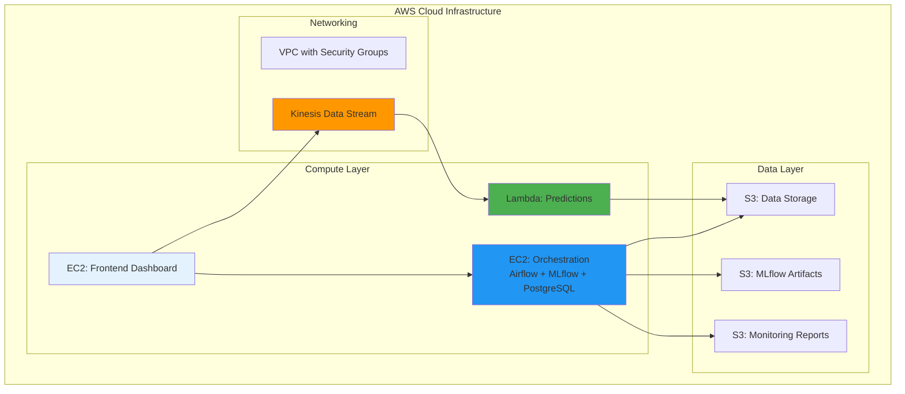
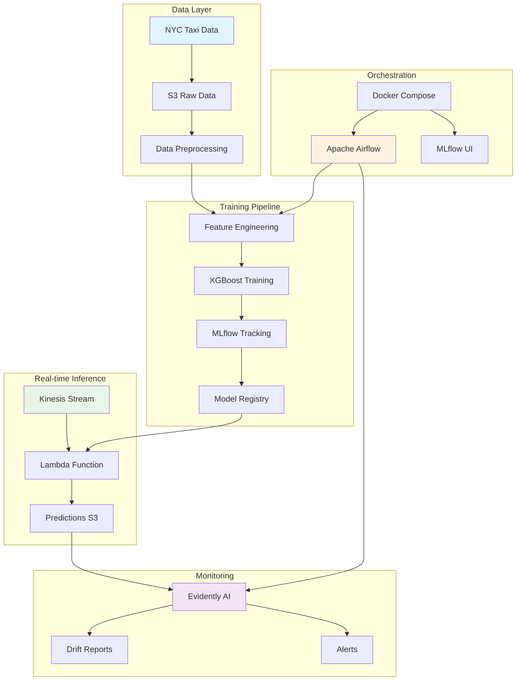
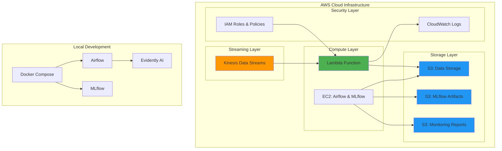
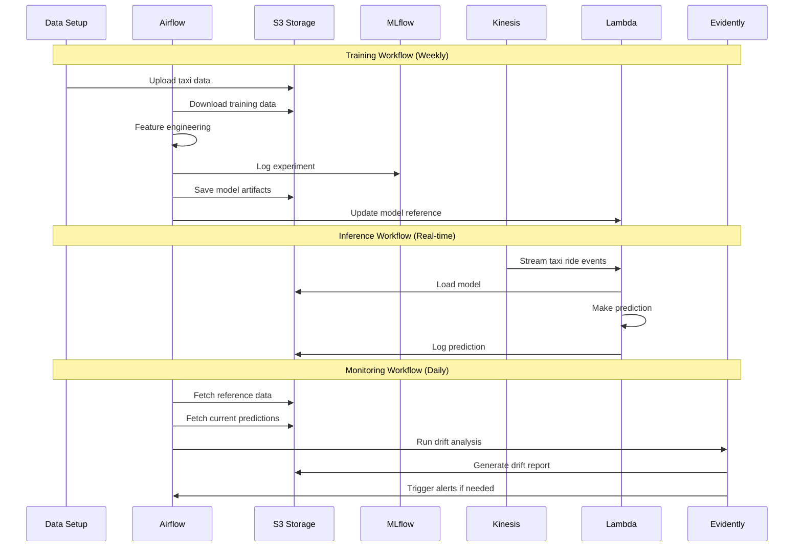

# NYC Taxi Trip Duration Prediction - MLOps Learning Project

Hi there!

If you're coming from MLOps Zoomcamp, here's the current status, important notes and things to check:
- I'm not yet versed in ML, so instead of making my own model, just reused that part from the course. Focused on using my background of sys admin to try and create an "easy to setup" pipeline.
- Used plenty of AI (mostly Claude) until it blew in my face and then been debugging manually. Some stuff (like the containers inside ec2 right now) sometimes need to be started manually
- Infra as code (terraform) deploying on cloud (AWS - you will need your credentials to check yourself, or ping me in the course Slack (André Calatré) if you want me to provision the infra momentarily)
- Serving mode as streaming (Kinesis/Lambda) or batch (airflow)
- There's CI CD (github actions) but no tests yet.
- No model monitoring implemented yet.
- Feel free to check more recent commits (maybe I fix or better document more things!)


**Personal learning project** for building an MLOps pipeline that predicts NYC taxi trip durations. This project emphasizes simplicity, cost-efficiency, and practical learning over enterprise-grade complexity.

## 📋 Project Status

**Infrastructure Configured - Ready for Full Deployment**
- ✅ Terraform configuration validated and tested
- ✅ EC2-based Docker Compose setup (cost-optimized)
- ✅ Lambda container deployment ready
- ⚠️ **Note**: Some resources are configured but not currently deployed or still buggy

## 🏗️ Current Architecture (Simplified & Cost-Optimized)



## 🏗️ Architecture Overview



## 🏛️ Infrastructure Diagram



## 🔄 Functional Workflow



## 🚀 Quick Start

### Prerequisites

- Docker and Docker Compose
- AWS CLI configured with appropriate permissions
- Terraform >= 1.0
- Python 3.9+

### 1. Clone and Setup

```bash
git clone <repository-url>
cd mlops-pipeline

# Set up environment variables
cp .env.example .env
# Edit .env with your AWS credentials and preferences
```

### 2. Deploy Infrastructure (on AWS)

```bash
cd infra
terraform init
terraform plan
terraform apply

# Note the outputs for later configuration
terraform output

# This will setup all AWS infrastructure 
```

### 3. Initialize Data and Test Pipeline (not yet done)

```bash
# Setup initial data
python scripts/data_setup.py

# Test end-to-end pipeline
python scripts/test_consumer.py

# Start event simulation (optional)
python scripts/event_simulation.py --max-events 100 --interval 2
```

### 4. Access Interfaces

- **Airflow UI**: http://[orchestration_instance_ip]:8080 (admin/admin)
- **MLflow UI**: http://[orchestration_instance_ip]:5000
- **Frontend UI**: http://[frontend_instance_ip]:5000
- **Evidently Reports**: Check S3 monitoring bucket (not yet done)

## 📊 Technology Stack

| Component | Technology | Purpose |
|-----------|------------|----------|
| **Cloud Provider** | AWS | Infrastructure hosting |
| **Infrastructure as Code** | Terraform | Resource provisioning |
| **Streaming** | Kinesis Data Streams | Real-time data ingestion |
| **Serverless Compute** | AWS Lambda | Real-time inference |
| **Storage** | Amazon S3 | Data and artifact storage |
| **Orchestration** | Apache Airflow | Workflow management |
| **Experiment Tracking** | MLflow | Model versioning and registry |
| **Monitoring** | Evidently AI | Data and model drift detection |
| **ML Model** | XGBoost | Regression model |
| **Feature Engineering** | Scikit-learn | Data preprocessing |
| **Containerization** | Docker | Local development environment |

## 📁 Project Structure (incomplete)

```
mlops-pipeline/
├── README.md                 # This comprehensive guide

├── .env.example             # Environment variables template
├── .gitignore              # Git ignore patterns
│
├── infra/                  # Terraform infrastructure


├── lambda_function/       # AWS Lambda inference
│   └── lambda_function.py # Real-time prediction service
│
├── scripts/              # Utility scripts
│   ├── data_setup.py     # Data download and preparation
│   ├── event_simulation.py # Event streaming simulation
│   ├── test_consumer.py  # End-to-end pipeline testing
│   └── ride.py          # Data structures

```

## 🔧 Configuration

### Environment Variables

Create a `.env` file in the root directory:

```bash
# AWS Configuration
AWS_ACCESS_KEY_ID=your_access_key
AWS_SECRET_ACCESS_KEY=your_secret_key
AWS_DEFAULT_REGION=us-east-1

# Project Configuration
DATA_STORAGE_BUCKET=mlops-taxi-prediction-data-storage-dev
KINESIS_STREAM_NAME=taxi-ride-predictions-stream
LAMBDA_FUNCTION_NAME=taxi-trip-duration-predictor

# MLflow Configuration
MLFLOW_TRACKING_URI=http://localhost:5000

```

### Terraform Variables

Customize infrastructure in `infra/variables.tf`:

```hcl
variable "project_name" {
  default = "mlops-taxi-prediction"
}

variable "aws_region" {
  default = "us-east-1"
}

variable "environment" {
  default = "dev"
}
```

## 🧪 Testing (not yet implemented)

### Unit Tests

```bash
# Test individual components
python -m pytest tests/

# Test data preprocessing
python scripts/data_setup.py

# Test model training (dry run)
python -c "from airflow.dags.training_dag import *; print('DAG syntax OK')"
```

### Integration Tests (not yet implemented)

```bash
# End-to-end pipeline test
python scripts/test_consumer.py

# Event simulation test
python scripts/event_simulation.py --max-events 10 --interval 1

# Check all services are responding
curl http://localhost:8080/health  # Airflow
curl http://localhost:5000         # MLflow
```

## 📈 Monitoring and Observability (not yet implemented)

### Key Metrics to Monitor

- **Data Quality**: Completeness, drift, outliers
- **Model Performance**: RMSE, MAE, R² score
- **System Health**: Lambda errors, Kinesis throughput
- **Pipeline Status**: DAG success rates, execution times

### Accessing Monitoring Data

```bash
# Check Evidently drift reports
aws s3 ls s3://your-monitoring-bucket/drift-reports/

# View CloudWatch logs
aws logs tail /aws/lambda/taxi-trip-duration-predictor --follow

# Check Airflow DAG runs
# Visit http://localhost:8080 → DAGs → taxi_model_training
```

## 💰 Cost Optimization

This project is optimized for learning with low AWS costs

## 🔧 Key Features

### Infrastructure as Code
- Modular Terraform design
- Remote state management (S3 + DynamoDB)
- Cost-optimized resource sizing

### ML Pipeline
- Automated retraining with Airflow
- Model versioning with MLflow
- Real-time inference with Lambda
- Drift monitoring with Evidently

### Simplified Operations
- No Kubernetes complexity
- Minimal security for learning
- Focus on core MLOps concepts

## 🧪 Testing the Pipeline

```bash
# Upload sample data to S3
python scripts/data_setup.py

# Simulate taxi ride events
python scripts/event_simulation.py --max-events 10

# Check Lambda logs
aws logs tail /aws/lambda/taxi-trip-duration-predictor
```

## ⚠️ Important Notes

1. **Learning Project**: Not production-ready, focuses on understanding MLOps concepts
2. **Security**: Basic security only - do not use for sensitive data

## 🛠️ Troubleshooting

### Common Issues

(to be populated. at this stage, mostly containers on the ec2 instances not starting automtically)

### Useful Commands

```bash

```

## 📚 Learning Resources

- [Terraform AWS Provider](https://registry.terraform.io/providers/hashicorp/aws/latest)
- [MLflow Documentation](https://mlflow.org/docs/latest/index.html)
- [Apache Airflow Guides](https://airflow.apache.org/docs/)

## 🤝 Acknowledgments

MLOps Zoomcamp!
---

