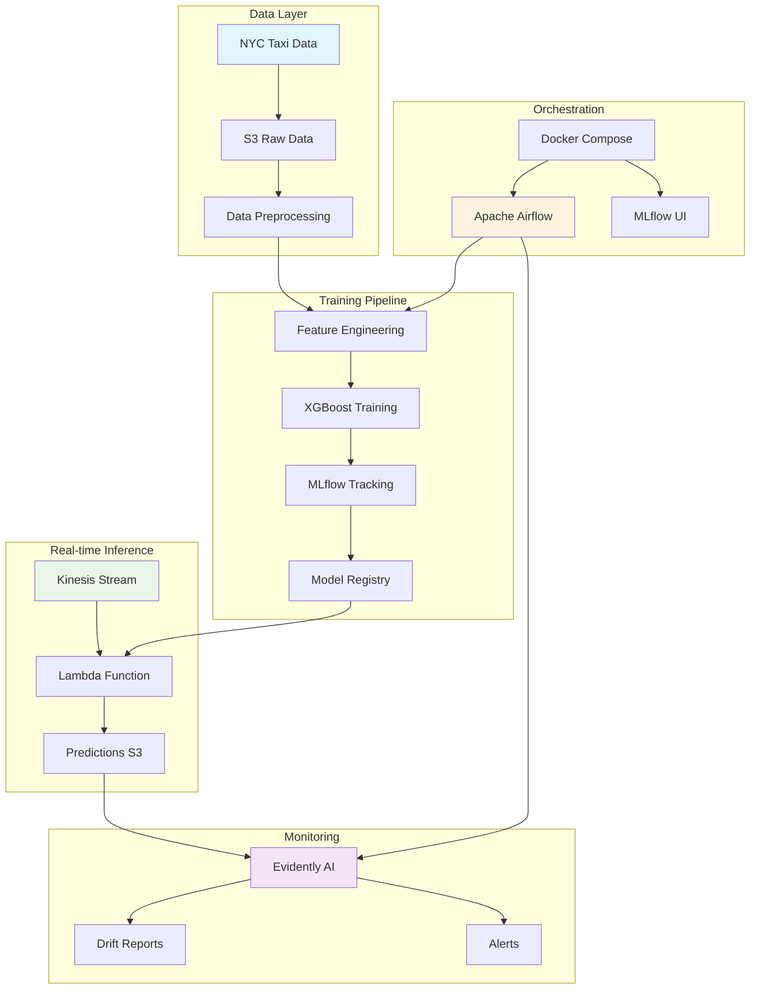
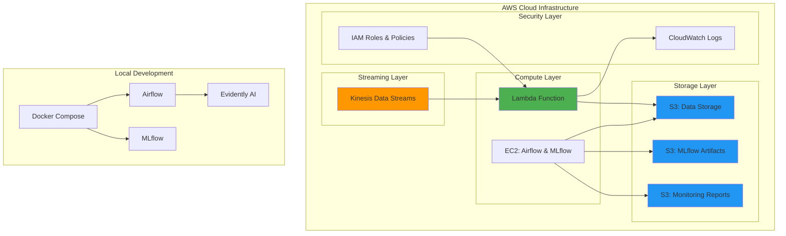
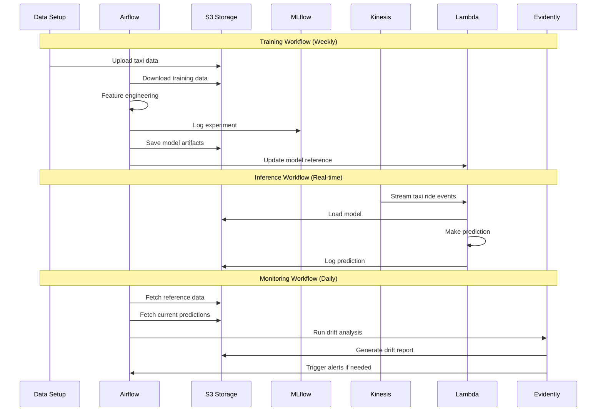

# NYC Taxi Trip Duration Prediction - MLOps Pipeline

[](https://github.com/DataTalksClub/mlops-zoomcamp)
[](https://aws.amazon.com/)
[](https://airflow.apache.org/)
[](https://mlflow.org/)
[](https://www.evidentlyai.com/)

A production-ready, end-to-end MLOps pipeline for predicting NYC taxi trip durations using real-time streaming data. This project demonstrates best practices in MLOps including automated training, monitoring, and deployment using modern cloud-native technologies.

## 🏗️ Architecture Overview



## 🏛️ Infrastructure Diagram



## 🔄 Functional Workflow



## 🚀 Quick Start

### Prerequisites

- Docker and Docker Compose
- AWS CLI configured with appropriate permissions
- Terraform >= 1.0
- Python 3.9+

### 1. Clone and Setup

```bash
git clone <repository-url>
cd mlops-pipeline

# Set up environment variables
cp .env.example .env
# Edit .env with your AWS credentials and preferences
```

### 2. Deploy Infrastructure

```bash
cd infra
terraform init
terraform plan
terraform apply

# Note the outputs for later configuration
terraform output
```

### 3. Start Local Services

```bash
cd ../airflow

# Set Airflow UID (Linux/Mac)
export AIRFLOW_UID=$(id -u)

# Start services
docker-compose up -d

# Check services are running
docker-compose ps
```

### 4. Initialize Data and Test Pipeline

```bash
# Setup initial data
python scripts/data_setup.py

# Test end-to-end pipeline
python scripts/test_consumer.py

# Start event simulation (optional)
python scripts/event_simulation.py --max-events 100 --interval 2
```

### 5. Access Interfaces

- **Airflow UI**: http://localhost:8080 (admin/admin)
- **MLflow UI**: http://localhost:5000
- **Evidently Reports**: Check S3 monitoring bucket

## 📊 Technology Stack

| Component | Technology | Purpose |
|-----------|------------|----------|
| **Cloud Provider** | AWS | Infrastructure hosting |
| **Infrastructure as Code** | Terraform | Resource provisioning |
| **Streaming** | Kinesis Data Streams | Real-time data ingestion |
| **Serverless Compute** | AWS Lambda | Real-time inference |
| **Storage** | Amazon S3 | Data and artifact storage |
| **Orchestration** | Apache Airflow | Workflow management |
| **Experiment Tracking** | MLflow | Model versioning and registry |
| **Monitoring** | Evidently AI | Data and model drift detection |
| **ML Model** | XGBoost | Regression model |
| **Feature Engineering** | Scikit-learn | Data preprocessing |
| **Containerization** | Docker | Local development environment |

## 📁 Project Structure

```
mlops-pipeline/
├── README.md                 # This comprehensive guide
├── to_check.md              # Failure points analysis
├── interface_to_do.md       # Web interface planning
├── .env.example             # Environment variables template
├── .gitignore              # Git ignore patterns
│
├── infra/                  # Terraform infrastructure
│   ├── main.tf            # Main infrastructure resources
│   ├── variables.tf       # Input variables
│   └── outputs.tf         # Output values
│
├── airflow/               # Airflow orchestration
│   ├── docker-compose.yaml # Local development services
│   ├── Dockerfile         # Custom Airflow image
│   └── dags/             # Airflow DAGs
│       ├── training_dag.py      # Model training pipeline
│       └── monitoring_dag.py    # Model monitoring pipeline
│
├── lambda_function/       # AWS Lambda inference
│   └── lambda_function.py # Real-time prediction service
│
├── scripts/              # Utility scripts
│   ├── data_setup.py     # Data download and preparation
│   ├── event_simulation.py # Event streaming simulation
│   ├── test_consumer.py  # End-to-end pipeline testing
│   └── ride.py          # Data structures
│
└── dashboard/           # Optional web interface
    ├── app.py          # Flask dashboard app
    └── templates/      # HTML templates
```

## 🔧 Configuration

### Environment Variables

Create a `.env` file in the root directory:

```bash
# AWS Configuration
AWS_ACCESS_KEY_ID=your_access_key
AWS_SECRET_ACCESS_KEY=your_secret_key
AWS_DEFAULT_REGION=us-east-1

# Project Configuration
DATA_STORAGE_BUCKET=mlops-taxi-prediction-data-storage-dev
KINESIS_STREAM_NAME=taxi-ride-predictions-stream
LAMBDA_FUNCTION_NAME=taxi-trip-duration-predictor

# MLflow Configuration
MLFLOW_TRACKING_URI=http://localhost:5000

# Airflow Configuration
AIRFLOW_UID=50000
_AIRFLOW_WWW_USER_USERNAME=admin
_AIRFLOW_WWW_USER_PASSWORD=admin
```

### Terraform Variables

Customize infrastructure in `infra/variables.tf`:

```hcl
variable "project_name" {
  default = "mlops-taxi-prediction"
}

variable "aws_region" {
  default = "us-east-1"
}

variable "environment" {
  default = "dev"
}
```

## 🧪 Testing

### Unit Tests

```bash
# Test individual components
python -m pytest tests/

# Test data preprocessing
python scripts/data_setup.py

# Test model training (dry run)
python -c "from airflow.dags.training_dag import *; print('DAG syntax OK')"
```

### Integration Tests

```bash
# End-to-end pipeline test
python scripts/test_consumer.py

# Event simulation test
python scripts/event_simulation.py --max-events 10 --interval 1

# Check all services are responding
curl http://localhost:8080/health  # Airflow
curl http://localhost:5000         # MLflow
```

## 📈 Monitoring and Observability

### Key Metrics to Monitor

- **Data Quality**: Completeness, drift, outliers
- **Model Performance**: RMSE, MAE, R² score
- **System Health**: Lambda errors, Kinesis throughput
- **Pipeline Status**: DAG success rates, execution times

### Accessing Monitoring Data

```bash
# Check Evidently drift reports
aws s3 ls s3://your-monitoring-bucket/drift-reports/

# View CloudWatch logs
aws logs tail /aws/lambda/taxi-trip-duration-predictor --follow

# Check Airflow DAG runs
# Visit http://localhost:8080 → DAGs → taxi_model_training
```

## 🛠️ Maintenance

### Regular Tasks

1. **Weekly**: Review model performance metrics
2. **Monthly**: Update dependencies and security patches
3. **Quarterly**: Review and optimize infrastructure costs
4. **As needed**: Retrain models if drift is detected

### Backup and Recovery

```bash
# Backup MLflow experiments
aws s3 sync s3://your-mlflow-bucket/ ./backups/mlflow/

# Backup Airflow configurations
docker-compose exec postgres pg_dump airflow > airflow_backup.sql

# Export Terraform state
terraform state pull > terraform_state_backup.json
```

## 🤝 Contributing

1. Fork the repository
2. Create a feature branch: `git checkout -b feature-name`
3. Make changes and test thoroughly
4. Submit a pull request with detailed description

## 📝 License

This project is licensed under the MIT License - see the LICENSE file for details.

## 🙏 Acknowledgments

- [DataTalks.Club MLOps Zoomcamp](https://github.com/DataTalksClub/mlops-zoomcamp) for the foundational knowledge
- NYC Taxi & Limousine Commission for the dataset
- Open source community for the amazing tools

---

**Built with ❤️ for the MLOps community**
