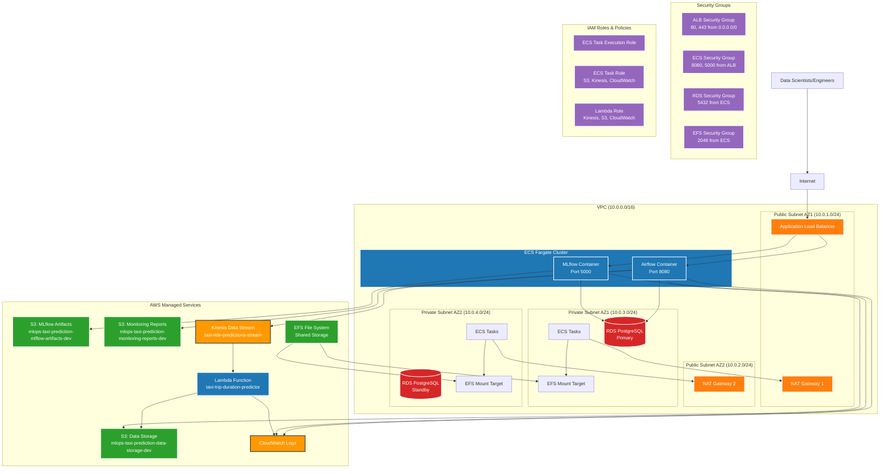

# MLOps Taxi Prediction Infrastructure

**Personal learning project** infrastructure using Terraform to deploy a cost-efficient MLOps pipeline on AWS.

> **Status**: Infrastructure ready for deployment. Lambda package built (392MB). Cost-optimized for ~$90-120/month.

## Architecture Overview

The infrastructure implements a multi-tier architecture with the following key components:

- **ECS Fargate** for containerized application hosting (Airflow, MLflow)
- **RDS PostgreSQL** for Airflow metadata database
- **S3** for MLflow artifacts and data storage
- **EFS** for persistent file system across containers
- **Kinesis** for real-time data streaming
- **Lambda** for serverless ML predictions
- **VPC** with public/private subnets for network isolation

## Architecture Diagram



## Components

### Networking

#### VPC Configuration
- **CIDR Block**: `10.0.0.0/16`
- **DNS Support**: Enabled for service discovery
- **DNS Hostnames**: Enabled for ALB and ECS services

#### Subnets
- **Public Subnets**: 2 subnets across different AZs for high availability
  - `10.0.1.0/24` (AZ1) - Hosts ALB and NAT Gateway
  - `10.0.2.0/24` (AZ2) - Hosts NAT Gateway
- **Private Subnets**: 2 subnets for secure resource deployment
  - `10.0.3.0/24` (AZ1) - ECS tasks, RDS primary, EFS mount target
  - `10.0.4.0/24` (AZ2) - ECS tasks, RDS standby, EFS mount target

#### Internet Connectivity
- **Internet Gateway**: Provides internet access to public subnets
- **NAT Gateways**: 2 NAT gateways for outbound internet access from private subnets

### Security Groups

#### Application Load Balancer Security Group
- **Inbound**: HTTP (80) and HTTPS (443) from anywhere
- **Outbound**: All traffic to anywhere

#### ECS Security Group  
- **Inbound**: 
  - Port 8080 (Airflow) from ALB security group
  - Port 5000 (MLflow) from ALB security group
- **Outbound**: All traffic to anywhere

#### RDS Security Group
- **Inbound**: PostgreSQL (5432) from ECS security group only
- **Outbound**: All traffic (for updates and maintenance)

#### EFS Security Group
- **Inbound**: NFS (2049) from ECS security group
- **Outbound**: All traffic

### Container Orchestration

#### ECS Fargate Cluster
- **Name**: `mlops-taxi-prediction-cluster-dev`
- **Capacity Providers**: FARGATE and FARGATE_SPOT
- **Default Strategy**: 100% FARGATE with base capacity of 1
- **Logging**: CloudWatch integration enabled

#### ECS Services (To be deployed)
- **Airflow Service**: Web server, scheduler, and worker components
- **MLflow Service**: Tracking server with S3 backend

### Database

#### RDS PostgreSQL Instance
- **Engine**: PostgreSQL 15.4
- **Instance Class**: `db.t3.micro` (configurable)
- **Storage**: 20GB GP3 with auto-scaling up to 100GB
- **Multi-AZ**: Enabled for high availability
- **Encryption**: Enabled at rest
- **Backup**: 7-day retention with automated snapshots
- **Maintenance Window**: Sunday 04:00-05:00 UTC

### Storage

#### S3 Buckets
1. **MLflow Artifacts**: `mlops-taxi-prediction-mlflow-artifacts-dev`
   - Stores ML models, metrics, and artifacts
   - Versioning enabled
   - Server-side encryption (AES256)

2. **Data Storage**: `mlops-taxi-prediction-data-storage-dev`
   - Raw data, processed data, and predictions
   - Versioning enabled
   - Server-side encryption (AES256)

3. **Monitoring Reports**: `mlops-taxi-prediction-monitoring-reports-dev`
   - Model performance reports and drift analysis
   - Server-side encryption (AES256)

#### EFS File System
- **Performance Mode**: General Purpose
- **Throughput Mode**: Provisioned (50 MiB/s)
- **Encryption**: Enabled
- **Lifecycle Policy**: Transition to IA after 30 days

### Streaming & Serverless

#### Kinesis Data Stream
- **Name**: `taxi-ride-predictions-stream`
- **Shards**: 1 (configurable)
- **Retention**: 24 hours
- **Metrics**: IncomingRecords, OutgoingRecords

#### Lambda Function
- **Name**: `taxi-trip-duration-predictor`
- **Runtime**: Python 3.10
- **Memory**: 256MB (configurable)
- **Timeout**: 30 seconds
- **Trigger**: Kinesis stream events

### IAM Roles & Policies

#### ECS Task Execution Role
- **Purpose**: Allows ECS to pull container images and write logs
- **Policies**: `AmazonECSTaskExecutionRolePolicy`

#### ECS Task Role
- **Purpose**: Grants application-level permissions to containers
- **Permissions**:
  - S3: Read/write access to all project buckets
  - Kinesis: Publish and consume from streams
  - CloudWatch: Create log groups and write logs

#### Lambda Execution Role
- **Purpose**: Enables Lambda to process Kinesis events and interact with AWS services
- **Permissions**:
  - Kinesis: Read from taxi predictions stream
  - S3: Read models, write predictions
  - CloudWatch: Logging

### Monitoring & Logging

#### CloudWatch Log Groups
- `/aws/lambda/taxi-trip-duration-predictor`: Lambda function logs
- `/aws/ecs/cluster/mlops-taxi-prediction-dev`: ECS cluster logs
- `/ecs/mlops-taxi-prediction-airflow-dev`: Airflow container logs
- `/ecs/mlops-taxi-prediction-mlflow-dev`: MLflow container logs

## Configuration

### Required Variables

Create a `terraform.tfvars` file with the following variables:

```hcl
# Project Configuration
project_name = "mlops-taxi-prediction"
environment  = "dev"
aws_region   = "eu-north-1"

# Database Configuration (CHANGE THESE!)
airflow_db_password = "your-secure-password-here"

# Optional Overrides
rds_instance_class = "db.t3.small"    # For production workloads
efs_provisioned_throughput = 100      # For higher I/O requirements
```

### Environment-Specific Configuration

#### Development
- RDS: `db.t3.micro`
- Skip final snapshots
- No deletion protection
- Performance Insights disabled

#### Production  
- RDS: `db.t3.small` or larger
- Final snapshots enabled
- Deletion protection enabled
- Performance Insights enabled
- Enhanced monitoring

## Deployment

### Prerequisites
1. AWS CLI configured with appropriate credentials
2. Terraform >= 1.0 installed
3. S3 backend bucket and DynamoDB table created (see `bootstrap/` directory)

### Deployment Steps

```bash
# 1. Build Lambda package first
cd ../scripts && bash build_lambda.sh && cd ../infra

# 2. Initialize Terraform
terraform init

# 3. Review the plan
terraform plan

# 4. Deploy infrastructure
terraform apply

# 5. Note the ALB DNS name for accessing services
terraform output alb_dns_name
```

### State Management
- **Backend**: S3 bucket `mlops-taxi-prediction-terraform-state`
- **State Locking**: DynamoDB table `terraform-state-lock`
- **Encryption**: Enabled
- **Versioning**: Enabled

## Outputs

The infrastructure provides the following outputs:

```hcl
# Networking
vpc_id                    = "vpc-xxxxx"
public_subnet_ids         = ["subnet-xxxxx", "subnet-yyyyy"]
private_subnet_ids        = ["subnet-zzzzz", "subnet-aaaaa"]

# Load Balancer
alb_dns_name              = "mlops-taxi-prediction-alb-dev-xxxxx.eu-north-1.elb.amazonaws.com"
alb_zone_id               = "Z23TAZ6LKFBQJK"

# ECS
ecs_cluster_name          = "mlops-taxi-prediction-cluster-dev"
ecs_cluster_arn           = "arn:aws:ecs:eu-north-1:xxxxx:cluster/mlops-taxi-prediction-cluster-dev"

# Database
rds_endpoint              = "mlops-taxi-prediction-airflow-db-dev.xxxxx.eu-north-1.rds.amazonaws.com"
rds_port                  = 5432

# Storage
mlflow_artifacts_bucket   = "mlops-taxi-prediction-mlflow-artifacts-dev"
data_storage_bucket       = "mlops-taxi-prediction-data-storage-dev"
efs_file_system_id        = "fs-xxxxx"

# Streaming
kinesis_stream_name       = "taxi-ride-predictions-stream"
lambda_function_name      = "taxi-trip-duration-predictor"
```

## Security Considerations

### Network Security
- Private subnets for databases and compute resources
- Security groups with least-privilege access
- NAT gateways for secure outbound internet access

### Data Security
- Encryption at rest for RDS, EFS, and S3
- Encryption in transit via HTTPS/TLS
- VPC endpoints for S3 access (recommended for production)

### Access Control
- IAM roles with minimal required permissions
- No hardcoded credentials in configurations
- Resource-based policies for S3 buckets

### Monitoring
- CloudWatch logging for all services
- VPC Flow Logs (recommended for production)
- AWS Config for compliance monitoring

## Cost Optimization

### Current Configuration (Learning-Optimized)
- **RDS t4g.micro (ARM)**: ~$12/month
- **ECS Fargate**: ~$20-30/month
- **NAT Gateway (Single)**: ~$45/month
- **EFS (Bursting)**: ~$5-10/month
- **S3**: ~$5-10/month
- **ALB**: ~$22/month
- **Lambda**: ~$1-5/month

**Total**: ~$90-120/month

### Applied Optimizations
✅ Single NAT gateway (saved $45/month)
✅ ARM-based RDS instance
✅ EFS bursting mode instead of provisioned
✅ 14-day CloudWatch log retention
✅ FARGATE_SPOT for non-critical tasks

## Troubleshooting

### Common Issues

#### ECS Tasks Not Starting
- Check security group rules
- Verify IAM roles and policies
- Review CloudWatch logs for container errors

#### Database Connection Issues
- Ensure security groups allow traffic from ECS to RDS
- Verify database credentials
- Check VPC DNS resolution

#### S3 Access Denied
- Review IAM policies for ECS task role
- Check S3 bucket policies
- Verify bucket names in environment variables

#### EFS Mount Issues
- Ensure EFS security group allows NFS traffic
- Verify mount targets in correct subnets
- Check ECS task definition for correct mount configuration

### Monitoring Commands

```bash
# Check ECS cluster status
aws ecs describe-clusters --clusters mlops-taxi-prediction-cluster-dev

# View RDS instance details
aws rds describe-db-instances --db-instance-identifier mlops-taxi-prediction-airflow-db-dev

# List S3 buckets
aws s3 ls | grep mlops-taxi-prediction

# Check Kinesis stream status
aws kinesis describe-stream --stream-name taxi-ride-predictions-stream

# View Lambda function details
aws lambda get-function --function-name taxi-trip-duration-predictor
```

## Next Steps

After infrastructure deployment:

1. **Deploy ECS Services**: Create task definitions and services for Airflow and MLflow
2. **Configure Airflow**: Set up connections to RDS, S3, and other AWS services
3. **Deploy ML Models**: Upload trained models to S3 for Lambda function
4. **Set up Monitoring**: Configure CloudWatch dashboards and alarms
5. **Implement CI/CD**: Automate deployments using GitHub Actions or similar

## Contributing

When making changes to the infrastructure:

1. Always run `terraform plan` before applying changes
2. Update this README if adding new components
3. Follow the existing naming conventions
4. Ensure security groups follow least-privilege principles
5. Update cost estimates when adding new resources

## References

- [AWS ECS Best Practices](https://docs.aws.amazon.com/AmazonECS/latest/bestpracticesguide/)
- [Terraform AWS Provider Documentation](https://registry.terraform.io/providers/hashicorp/aws/latest/docs)
- [MLflow on AWS](https://mlflow.org/docs/latest/deployment.html#deploy-mlflow-on-aws)
- [Apache Airflow on AWS](https://docs.aws.amazon.com/mwaa/latest/userguide/what-is-mwaa.html)
