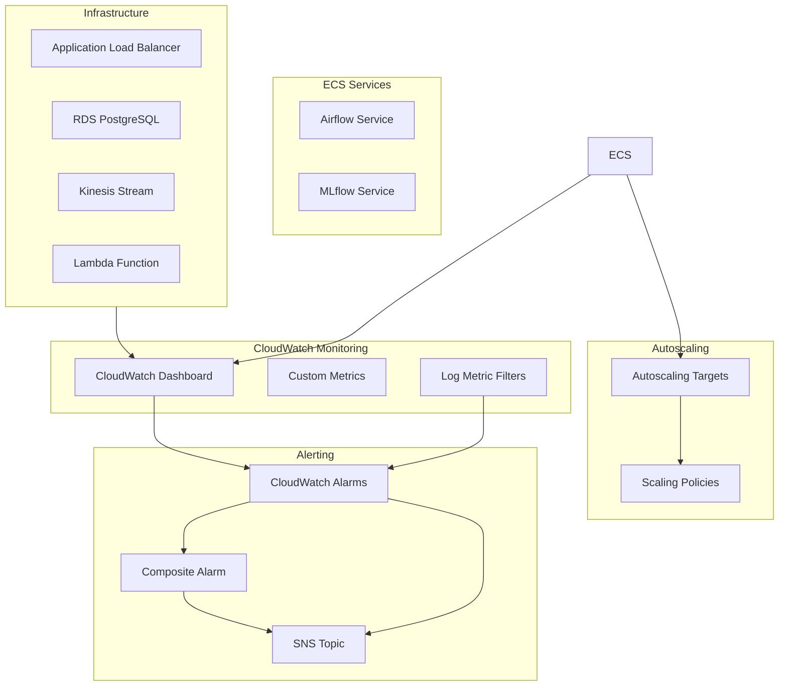

# Monitoring Module (Optional)

**Cost-conscious monitoring** for the MLOps learning project. Creates basic CloudWatch dashboards and alarms without breaking the bank.

> ⚠️ **Note**: This module is ready but not integrated by default to keep costs minimal.

## Features

### 🔍 CloudWatch Monitoring
- **Comprehensive Dashboard**: Real-time visualization of all critical metrics
- **ECS Service Metrics**: CPU, Memory, Task Count monitoring for Airflow and MLflow
- **Infrastructure Metrics**: ALB, RDS, Kinesis, and Lambda performance monitoring
- **Log Analysis**: Automated log parsing with custom metric filters

### 📊 Autoscaling
- **Target Tracking Policies**: CPU and memory-based autoscaling for ECS services
- **Configurable Thresholds**: Customizable target values and capacity limits
- **Cost Optimization**: Conservative scaling policies for development environments

### 🚨 Alerting
- **Multi-tier Alarms**: Critical, performance, and application-level alerts
- **SNS Integration**: Centralized notification system
- **Composite Alarms**: Overall service health monitoring
- **MLOps-specific Alerts**: Model accuracy and pipeline health monitoring

## Architecture



## Usage

```hcl
module "monitoring" {
  source = "./modules/monitoring"
  
  # Basic Configuration
  project_name = var.project_name
  environment  = var.environment
  aws_region   = var.aws_region
  tags         = var.tags
  
  # ECS Service Information
  cluster_name          = aws_ecs_cluster.main.name
  airflow_service_name  = aws_ecs_service.airflow.name
  mlflow_service_name   = aws_ecs_service.mlflow.name
  
  # Infrastructure Resources
  alb_name               = aws_lb.main.arn_suffix
  rds_identifier         = aws_db_instance.airflow.id
  kinesis_stream_name    = aws_kinesis_stream.taxi_predictions.name
  lambda_function_name   = "taxi-trip-duration-predictor"  # Optional
  
  # Log Groups
  airflow_log_group_name = aws_cloudwatch_log_group.airflow.name
  mlflow_log_group_name  = aws_cloudwatch_log_group.mlflow.name
  
  # Autoscaling Configuration
  airflow_min_capacity = 1
  airflow_max_capacity = 5
  mlflow_min_capacity  = 1
  mlflow_max_capacity  = 3
  
  # Notification Configuration
  enable_email_notifications = false
  sns_email_endpoints = []  # Add email addresses if notifications needed
}
```

## Inputs

| Name | Description | Type | Default | Required |
|------|-------------|------|---------|:--------:|
| project_name | Name of the project | `string` | n/a | yes |
| environment | Environment (dev, staging, prod) | `string` | n/a | yes |
| aws_region | AWS region | `string` | n/a | yes |
| cluster_name | Name of the ECS cluster | `string` | n/a | yes |
| airflow_service_name | Name of the Airflow ECS service | `string` | n/a | yes |
| mlflow_service_name | Name of the MLflow ECS service | `string` | n/a | yes |
| alb_name | ALB ARN suffix | `string` | n/a | yes |
| rds_identifier | RDS instance identifier | `string` | n/a | yes |
| kinesis_stream_name | Kinesis stream name | `string` | n/a | yes |
| airflow_log_group_name | Airflow CloudWatch log group name | `string` | n/a | yes |
| mlflow_log_group_name | MLflow CloudWatch log group name | `string` | n/a | yes |
| lambda_function_name | Lambda function name (optional) | `string` | `""` | no |
| airflow_min_capacity | Minimum Airflow tasks | `number` | `1` | no |
| airflow_max_capacity | Maximum Airflow tasks | `number` | `5` | no |
| mlflow_min_capacity | Minimum MLflow tasks | `number` | `1` | no |
| mlflow_max_capacity | Maximum MLflow tasks | `number` | `3` | no |
| airflow_cpu_target_value | CPU target for Airflow autoscaling (%) | `number` | `70` | no |
| airflow_memory_target_value | Memory target for Airflow autoscaling (%) | `number` | `70` | no |
| mlflow_cpu_target_value | CPU target for MLflow autoscaling (%) | `number` | `70` | no |
| mlflow_memory_target_value | Memory target for MLflow autoscaling (%) | `number` | `70` | no |

## Outputs

| Name | Description |
|------|-------------|
| sns_topic_arn | ARN of the SNS topic for alerts |
| dashboard_name | Name of the CloudWatch dashboard |
| dashboard_url | Direct URL to CloudWatch dashboard |
| monitoring_summary | Summary of all monitoring resources created |
| critical_alarms | Map of critical alarm ARNs |
| service_health_alarm_arn | ARN of composite service health alarm |

## Monitoring Resources Created

### CloudWatch Alarms
1. **ECS Service Alarms**
   - High CPU utilization (>80%)
   - High memory utilization (>85%)
   - Service down (running tasks < 1)

2. **ALB Alarms**
   - High response time (>3 seconds)
   - High 5XX error rate (>10 errors)

3. **RDS Alarms**
   - High CPU utilization (>80%)
   - High connection count (>40 connections)
   - Low free storage space (<2GB)

4. **Kinesis Alarms**
   - PUT records failures (>5 errors)

5. **Lambda Alarms** (if enabled)
   - High error rate (>5 errors)
   - High duration (>25 seconds)

6. **Application Alarms**
   - Airflow log errors (>3 errors)
   - ML model accuracy degradation (<75%)

### Autoscaling Policies
- **Airflow**: CPU and memory target tracking policies
- **MLflow**: CPU target tracking policy

### Dashboard Widgets
- ECS service resource utilization
- ALB performance metrics
- RDS performance metrics
- Kinesis stream metrics
- Recent error logs from Airflow

## Cost Impact

### Monitoring Costs (if enabled)
- **CloudWatch Alarms**: ~$0.10 per alarm (~$1.50/month for 15 alarms)
- **Dashboard**: Free (first 3 dashboards)
- **SNS**: Free tier usually sufficient
- **Custom Metrics**: ~$0.30 per metric

**Total**: ~$2-5/month extra

### 💡 Cost Tip
For learning purposes, you can monitor services manually through the AWS Console instead of enabling this module.

## Customization

### Alarm Thresholds
All alarm thresholds are configurable via variables:

```hcl
# Custom thresholds
cpu_alarm_threshold = 85
memory_alarm_threshold = 90
alb_response_time_threshold = 5
model_accuracy_threshold = 0.80
```

### SNS Notifications
Enable email notifications:

```hcl
enable_email_notifications = true
sns_email_endpoints = [
  "devops@company.com",
  "alerts@company.com"
]
```

### Custom Metrics
The module includes custom metric filters for:
- Airflow error detection from logs
- ML model accuracy tracking from application logs

Add your own metrics by extending the log metric filters.

## Troubleshooting

### Common Issues

1. **Missing ECS Metrics**
   - Ensure Container Insights is enabled on the ECS cluster
   - Check that service names match exactly

2. **No Alarm Notifications**
   - Verify SNS topic permissions
   - Confirm email subscription if using email notifications

3. **Dashboard Not Loading**
   - Check CloudWatch permissions
   - Verify metric namespaces are correct

4. **Autoscaling Not Working**
   - Ensure ECS service has proper IAM roles
   - Check autoscaling target registration

### Monitoring Commands

```bash
# Check alarm states
aws cloudwatch describe-alarms --region eu-north-1

# View dashboard
aws cloudwatch get-dashboard --dashboard-name mlops-taxi-prediction-pipeline-dev

# Check autoscaling policies
aws application-autoscaling describe-scaling-policies --service-namespace ecs

# Test SNS notifications
aws sns publish --topic-arn <topic-arn> --message "Test notification"
```

## Integration with Main Infrastructure

This module is designed to be integrated with the main MLOps infrastructure:

```hcl
# In main-modular.tf
module "monitoring" {
  source = "./modules/monitoring"
  
  # Pass references to existing resources
  cluster_name = aws_ecs_cluster.main.name
  alb_name     = aws_lb.main.arn_suffix
  # ... other configuration
}
```

The module automatically creates dependencies on the infrastructure resources and provides comprehensive monitoring coverage for the entire MLOps pipeline.
