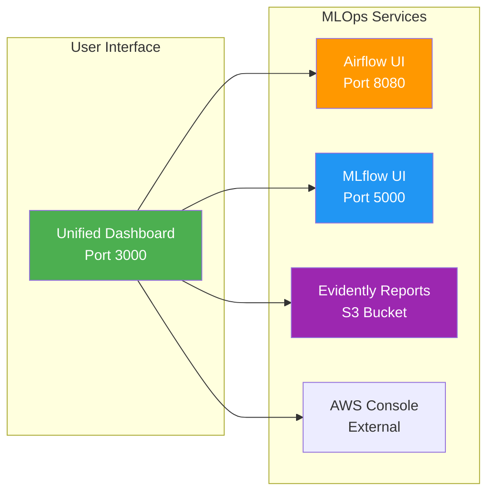
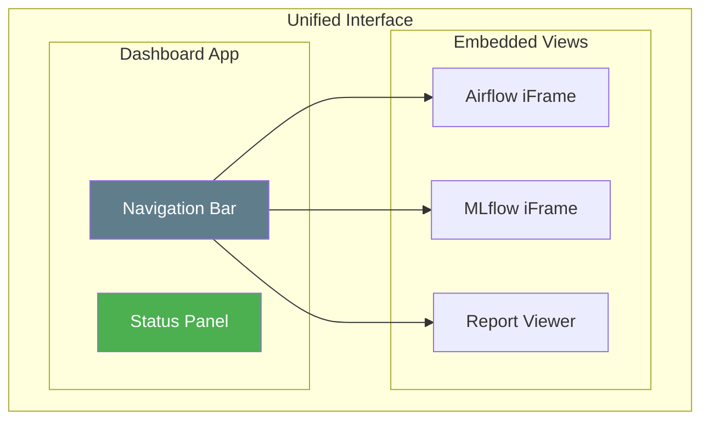
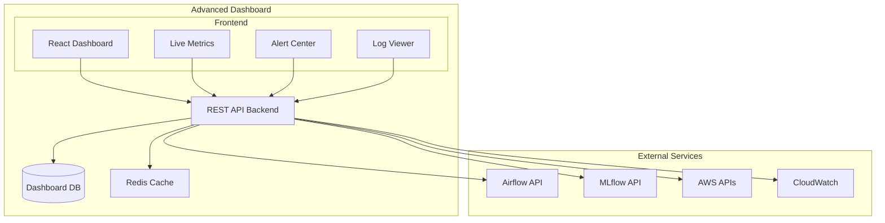

# Optional Web Dashboard (Future Enhancement)

**Simple dashboard idea** for accessing all MLOps services from one place. This is optional and can be built after the main pipeline is working.

## Why Build This?

- **Convenience**: Access Airflow and MLflow from one page
- **Learning**: Practice building a simple web app
- **Monitoring**: Quick health checks without AWS Console

## 🏗️ Architecture Options

### Option 1: Simple Dashboard (Recommended for MVP)



**Implementation**: Flask/FastAPI app with HTML templates  
**Effort**: 🟢 Low (1-2 days)  
**Features**: 
- Service status indicators
- Direct links to interfaces
- Basic health checks
- Responsive design

### Option 2: Embedded Dashboard



**Implementation**: React/Vue app with iframe embedding  
**Effort**: 🟡 Medium (3-5 days)  
**Features**:
- Embedded service interfaces
- Tabbed navigation
- Service health monitoring
- Custom CSS theming

### Option 3: Advanced Integration Dashboard



**Implementation**: Full-stack application with APIs  
**Effort**: 🔴 High (1-2 weeks)  
**Features**:
- Custom metrics aggregation
- Real-time monitoring
- Alert management
- User management
- Custom dashboards

## Quick Implementation (1-2 hours)

For a learning project, keep it super simple:
```
dashboard/
├── app.py                  # Flask application
├── requirements.txt        # Python dependencies
├── config.py              # Configuration settings
├── templates/
│   ├── base.html          # Base template
│   ├── index.html         # Main dashboard
│   └── service.html       # Service detail page
├── static/
│   ├── css/
│   │   └── dashboard.css  # Custom styles
│   ├── js/
│   │   └── dashboard.js   # Frontend logic
│   └── img/
│       └── logos/         # Service logos
└── utils/
    ├── health_checks.py   # Service health monitoring
    └── helpers.py         # Utility functions
```

### Core Implementation

#### 1. Flask Application (`app.py`)

```python
from flask import Flask, render_template, jsonify
import requests
import boto3
from datetime import datetime
import os

app = Flask(__name__)

# Service configuration
SERVICES = {
    'airflow': {
        'name': 'Apache Airflow',
        'url': 'http://localhost:8080',
        'health_endpoint': '/health',
        'icon': 'airflow-logo.png',
        'description': 'Workflow Orchestration'
    },
    'mlflow': {
        'name': 'MLflow',
        'url': 'http://localhost:5000',
        'health_endpoint': '/',
        'icon': 'mlflow-logo.png',
        'description': 'Experiment Tracking'
    },
    'aws_console': {
        'name': 'AWS Console',
        'url': 'https://console.aws.amazon.com/s3/',
        'external': True,
        'icon': 'aws-logo.png',
        'description': 'Cloud Infrastructure'
    }
}

@app.route('/')
def dashboard():
    \"\"\"Main dashboard page\"\"\"\n    service_status = {}\n    \n    for service_id, config in SERVICES.items():\n        if not config.get('external', False):\n            status = check_service_health(config['url'], config['health_endpoint'])\n        else:\n            status = {'healthy': True, 'external': True}\n        \n        service_status[service_id] = {\n            **config,\n            'status': status,\n            'last_checked': datetime.now().strftime('%H:%M:%S')\n        }\n    \n    return render_template('index.html', services=service_status)

@app.route('/api/health/<service_id>')\ndef service_health(service_id):\n    \"\"\"API endpoint for individual service health\"\"\"\n    if service_id not in SERVICES:\n        return jsonify({'error': 'Service not found'}), 404\n    \n    config = SERVICES[service_id]\n    if config.get('external', False):\n        return jsonify({'healthy': True, 'external': True})\n    \n    status = check_service_health(config['url'], config['health_endpoint'])\n    return jsonify(status)

@app.route('/api/metrics')\ndef get_metrics():\n    \"\"\"Get aggregated metrics from all services\"\"\"\n    try:\n        metrics = {\n            'airflow_dags': get_airflow_dag_status(),\n            'mlflow_experiments': get_mlflow_experiment_count(),\n            'aws_resources': get_aws_resource_status(),\n            'last_updated': datetime.now().isoformat()\n        }\n        return jsonify(metrics)\n    except Exception as e:\n        return jsonify({'error': str(e)}), 500

def check_service_health(base_url, health_endpoint):\n    \"\"\"Check if a service is healthy\"\"\"\n    try:\n        response = requests.get(f\"{base_url}{health_endpoint}\", timeout=5)\n        return {\n            'healthy': response.status_code == 200,\n            'status_code': response.status_code,\n            'response_time': response.elapsed.total_seconds()\n        }\n    except Exception as e:\n        return {\n            'healthy': False,\n            'error': str(e),\n            'response_time': None\n        }\n\ndef get_airflow_dag_status():\n    \"\"\"Get Airflow DAG statistics\"\"\"\n    try:\n        # Use Airflow REST API\n        response = requests.get('http://localhost:8080/api/v1/dags', \n                              auth=('admin', 'admin'), timeout=10)\n        if response.status_code == 200:\n            dags = response.json()['dags']\n            return {\n                'total_dags': len(dags),\n                'active_dags': len([d for d in dags if not d['is_paused']]),\n                'paused_dags': len([d for d in dags if d['is_paused']])\n            }\n    except:\n        pass\n    \n    return {'total_dags': '?', 'active_dags': '?', 'paused_dags': '?'}\n\ndef get_mlflow_experiment_count():\n    \"\"\"Get MLflow experiment count\"\"\"\n    try:\n        response = requests.get('http://localhost:5000/api/2.0/mlflow/experiments/search', timeout=10)\n        if response.status_code == 200:\n            experiments = response.json()['experiments']\n            return {'total_experiments': len(experiments)}\n    except:\n        pass\n    \n    return {'total_experiments': '?'}\n\ndef get_aws_resource_status():\n    \"\"\"Get AWS resource status\"\"\"\n    try:\n        s3 = boto3.client('s3')\n        lambda_client = boto3.client('lambda')\n        \n        # Count S3 buckets\n        buckets = s3.list_buckets()['Buckets']\n        mlops_buckets = [b for b in buckets if 'mlops-taxi-prediction' in b['Name']]\n        \n        # Check Lambda function\n        try:\n            lambda_client.get_function(FunctionName='taxi-trip-duration-predictor')\n            lambda_status = 'Active'\n        except:\n            lambda_status = 'Not Found'\n        \n        return {\n            'mlops_buckets': len(mlops_buckets),\n            'lambda_status': lambda_status\n        }\n    except:\n        return {'mlops_buckets': '?', 'lambda_status': '?'}\n\nif __name__ == '__main__':\n    app.run(host='0.0.0.0', port=3000, debug=True)\n```

#### 2. Main Dashboard Template (`templates/index.html`)

```html\n<!DOCTYPE html>\n<html lang=\"en\">\n<head>\n    <meta charset=\"UTF-8\">\n    <meta name=\"viewport\" content=\"width=device-width, initial-scale=1.0\">\n    <title>MLOps Dashboard - NYC Taxi Prediction</title>\n    <link href=\"https://cdn.jsdelivr.net/npm/bootstrap@5.1.3/dist/css/bootstrap.min.css\" rel=\"stylesheet\">\n    <link href=\"https://cdnjs.cloudflare.com/ajax/libs/font-awesome/6.0.0/css/all.min.css\" rel=\"stylesheet\">\n    <link href=\"{{ url_for('static', filename='css/dashboard.css') }}\" rel=\"stylesheet\">\n</head>\n<body>\n    <nav class=\"navbar navbar-dark bg-dark\">\n        <div class=\"container-fluid\">\n            <span class=\"navbar-brand mb-0 h1\">\n                <i class=\"fas fa-taxi\"></i>\n                MLOps Dashboard - NYC Taxi Prediction\n            </span>\n            <span class=\"navbar-text\" id=\"last-updated\">\n                Last updated: <span id=\"update-time\">{{ current_time }}</span>\n            </span>\n        </div>\n    </nav>\n\n    <div class=\"container-fluid mt-4\">\n        <!-- System Status Overview -->\n        <div class=\"row mb-4\">\n            <div class=\"col-12\">\n                <div class=\"card\">\n                    <div class=\"card-header\">\n                        <h5><i class=\"fas fa-heartbeat\"></i> System Status</h5>\n                    </div>\n                    <div class=\"card-body\">\n                        <div class=\"row\" id=\"status-indicators\">\n                            \n                            <div class=\"col-md-3 mb-3\">\n                                <div class=\"status-card status-healthystatus-unhealthy\">\n                                    <div class=\"status-header\">\n                                        <i class=\"fas fa-circle status-indicator\"></i>\n                                        <strong>{{ service.name }}</strong>\n                                    </div>\n                                    <div class=\"status-details\">\n                                        <small>{{ service.description }}</small>\n                                        \n                                        <br><small class=\"text-muted\">Response: {{ service.status.response_time or 'N/A' }}s</small>\n                                        \n                                    </div>\n                                </div>\n                            </div>\n                            \n                        </div>\n                    </div>\n                </div>\n            </div>\n        </div>\n\n        <!-- Service Access Cards -->\n        <div class=\"row\">\n            \n            <div class=\"col-lg-6 mb-4\">\n                <div class=\"card service-card\">\n                    <div class=\"card-header d-flex align-items-center\">\n                        \n                        <div>\n                            <h5 class=\"mb-0\">{{ service.name }}</h5>\n                            <small class=\"text-muted\">{{ service.description }}</small>\n                        </div>\n                    </div>\n                    <div class=\"card-body\">\n                        <div class=\"row\">\n                            <div class=\"col-md-8\">\n                                <p class=\"card-text\">{{ service.get('long_description', 'Access the ' + service.name + ' interface.') }}</p>\n                                \n                                \n                                <div class=\"service-metrics\">\n                                    <small class=\"text-muted\">\n                                        <i class=\"fas fa-project-diagram\"></i> DAGs: <span id=\"airflow-dags\">Loading...</span> |\n                                        <i class=\"fas fa-play\"></i> Active: <span id=\"airflow-active\">Loading...</span>\n                                    </small>\n                                </div>\n                                \n                                <div class=\"service-metrics\">\n                                    <small class=\"text-muted\">\n                                        <i class=\"fas fa-flask\"></i> Experiments: <span id=\"mlflow-experiments\">Loading...</span>\n                                    </small>\n                                </div>\n                                \n                            </div>\n                            <div class=\"col-md-4 text-end\">\n                                <a href=\"{{ service.url }}\" \n                                   target=\"_blank\" \n                                   class=\"btn btn-primary btn-lg\">\n                                    <i class=\"fas fa-external-link-alt\"></i>\n                                    Open {{ service.name }}\n                                </a>\n                                \n                                \n                                <br><br>\n                                <button class=\"btn btn-sm btn-outline-secondary\" \n                                        onclick=\"checkServiceHealth('{{ service_id }}')\">\n                                    <i class=\"fas fa-sync\"></i> Check Status\n                                </button>\n                                \n                            </div>\n                        </div>\n                        \n                        <!-- Quick Actions -->\n                        \n                        <div class=\"mt-3\">\n                            <div class=\"btn-group\" role=\"group\">\n                                <a href=\"{{ service.url }}/dag/taxi_model_training\" target=\"_blank\" class=\"btn btn-sm btn-outline-info\">\n                                    <i class=\"fas fa-train\"></i> Training DAG\n                                </a>\n                                <a href=\"{{ service.url }}/dag/taxi_model_monitoring\" target=\"_blank\" class=\"btn btn-sm btn-outline-warning\">\n                                    <i class=\"fas fa-chart-line\"></i> Monitoring DAG\n                                </a>\n                            </div>\n                        </div>\n                        \n                        <div class=\"mt-3\">\n                            <div class=\"btn-group\" role=\"group\">\n                                <a href=\"{{ service.url }}/#/experiments/1\" target=\"_blank\" class=\"btn btn-sm btn-outline-info\">\n                                    <i class=\"fas fa-flask\"></i> Experiments\n                                </a>\n                                <a href=\"{{ service.url }}/#/models\" target=\"_blank\" class=\"btn btn-sm btn-outline-success\">\n                                    <i class=\"fas fa-cube\"></i> Models\n                                </a>\n                            </div>\n                        </div>\n                        \n                    </div>\n                </div>\n            </div>\n            \n        </div>\n\n        <!-- Additional Tools -->\n        <div class=\"row\">\n            <div class=\"col-12\">\n                <div class=\"card\">\n                    <div class=\"card-header\">\n                        <h5><i class=\"fas fa-tools\"></i> Additional Tools & Resources</h5>\n                    </div>\n                    <div class=\"card-body\">\n                        <div class=\"row\">\n                            <div class=\"col-md-4\">\n                                <h6><i class=\"fas fa-chart-bar\"></i> Monitoring Reports</h6>\n                                <p><small class=\"text-muted\">Access Evidently AI drift reports and data quality assessments.</small></p>\n                                <button class=\"btn btn-sm btn-info\" onclick=\"openEvidently()\">\n                                    <i class=\"fas fa-external-link-alt\"></i> View Reports\n                                </button>\n                            </div>\n                            <div class=\"col-md-4\">\n                                <h6><i class=\"fas fa-terminal\"></i> Pipeline Testing</h6>\n                                <p><small class=\"text-muted\">Test the end-to-end pipeline and simulate events.</small></p>\n                                <div class=\"btn-group-vertical\" role=\"group\">\n                                    <button class=\"btn btn-sm btn-success mb-2\" onclick=\"runPipelineTest()\">\n                                        <i class=\"fas fa-play\"></i> Run E2E Test\n                                    </button>\n                                    <button class=\"btn btn-sm btn-warning\" onclick=\"simulateEvents()\">\n                                        <i class=\"fas fa-stream\"></i> Simulate Events\n                                    </button>\n                                </div>\n                            </div>\n                            <div class=\"col-md-4\">\n                                <h6><i class=\"fas fa-cloud\"></i> AWS Resources</h6>\n                                <p><small class=\"text-muted\">Buckets: <span id=\"aws-buckets\">Loading...</span> | Lambda: <span id=\"aws-lambda\">Loading...</span></small></p>\n                                <div class=\"btn-group\" role=\"group\">\n                                    <a href=\"https://console.aws.amazon.com/s3/\" target=\"_blank\" class=\"btn btn-sm btn-primary\">\n                                        <i class=\"fab fa-aws\"></i> S3 Console\n                                    </a>\n                                    <a href=\"https://console.aws.amazon.com/lambda/\" target=\"_blank\" class=\"btn btn-sm btn-primary\">\n                                        <i class=\"fas fa-bolt\"></i> Lambda Console\n                                    </a>\n                                </div>\n                            </div>\n                        </div>\n                    </div>\n                </div>\n            </div>\n        </div>\n    </div>\n\n    <!-- Footer -->\n    <footer class=\"bg-dark text-light mt-5 py-4\">\n        <div class=\"container\">\n            <div class=\"row\">\n                <div class=\"col-md-6\">\n                    <h6>NYC Taxi Duration Prediction MLOps Pipeline</h6>\n                    <p><small>Built with ❤️ for the MLOps community</small></p>\n                </div>\n                <div class=\"col-md-6 text-end\">\n                    <small>\n                        <i class=\"fas fa-info-circle\"></i> \n                        Need help? Check the \n                        <a href=\"https://github.com/your-repo/mlops-pipeline\" class=\"text-light\">documentation</a>\n                    </small>\n                </div>\n            </div>\n        </div>\n    </footer>\n\n    <script src=\"https://cdn.jsdelivr.net/npm/bootstrap@5.1.3/dist/js/bootstrap.bundle.min.js\"></script>\n    <script src=\"{{ url_for('static', filename='js/dashboard.js') }}\"></script>\n</body>\n</html>\n```\n\n#### 3. Frontend JavaScript (`static/js/dashboard.js`)\n\n```javascript\n// Dashboard functionality\nclass MLOpsDashboard {\n    constructor() {\n        this.refreshInterval = 30000; // 30 seconds\n        this.init();\n    }\n\n    init() {\n        this.loadMetrics();\n        this.startAutoRefresh();\n        this.setupEventHandlers();\n    }\n\n    async loadMetrics() {\n        try {\n            const response = await fetch('/api/metrics');\n            const metrics = await response.json();\n            \n            // Update Airflow metrics\n            if (metrics.airflow_dags) {\n                document.getElementById('airflow-dags').textContent = metrics.airflow_dags.total_dags;\n                document.getElementById('airflow-active').textContent = metrics.airflow_dags.active_dags;\n            }\n            \n            // Update MLflow metrics\n            if (metrics.mlflow_experiments) {\n                document.getElementById('mlflow-experiments').textContent = metrics.mlflow_experiments.total_experiments;\n            }\n            \n            // Update AWS metrics\n            if (metrics.aws_resources) {\n                document.getElementById('aws-buckets').textContent = metrics.aws_resources.mlops_buckets;\n                document.getElementById('aws-lambda').textContent = metrics.aws_resources.lambda_status;\n            }\n            \n            // Update last updated time\n            document.getElementById('update-time').textContent = new Date().toLocaleTimeString();\n            \n        } catch (error) {\n            console.error('Error loading metrics:', error);\n        }\n    }\n\n    async checkServiceHealth(serviceId) {\n        try {\n            const response = await fetch(`/api/health/${serviceId}`);\n            const health = await response.json();\n            \n            // Update status indicator\n            const statusCard = document.querySelector(`[data-service=\"${serviceId}\"]`);\n            if (statusCard) {\n                statusCard.className = health.healthy ? 'status-healthy' : 'status-unhealthy';\n            }\n            \n            // Show notification\n            this.showNotification(\n                health.healthy ? 'Service is healthy' : 'Service is experiencing issues',\n                health.healthy ? 'success' : 'danger'\n            );\n        } catch (error) {\n            console.error('Error checking service health:', error);\n            this.showNotification('Error checking service health', 'danger');\n        }\n    }\n    \n    showNotification(message, type = 'info') {\n        // Create and show Bootstrap toast notification\n        const toastHtml = `\n            <div class=\"toast\" role=\"alert\" aria-live=\"assertive\" aria-atomic=\"true\">\n                <div class=\"toast-header\">\n                    <strong class=\"me-auto\">System Status</strong>\n                    <button type=\"button\" class=\"btn-close\" data-bs-dismiss=\"toast\"></button>\n                </div>\n                <div class=\"toast-body alert-${type}\">\n                    ${message}\n                </div>\n            </div>\n        `;\n        \n        // Add to toast container or create one\n        let toastContainer = document.getElementById('toast-container');\n        if (!toastContainer) {\n            toastContainer = document.createElement('div');\n            toastContainer.id = 'toast-container';\n            toastContainer.className = 'toast-container position-fixed bottom-0 end-0 p-3';\n            document.body.appendChild(toastContainer);\n        }\n        \n        toastContainer.innerHTML = toastHtml;\n        const toast = new bootstrap.Toast(toastContainer.querySelector('.toast'));\n        toast.show();\n    }\n\n    startAutoRefresh() {\n        setInterval(() => {\n            this.loadMetrics();\n        }, this.refreshInterval);\n    }\n\n    setupEventHandlers() {\n        // Handle service health checks\n        window.checkServiceHealth = (serviceId) => {\n            this.checkServiceHealth(serviceId);\n        };\n        \n        // Handle Evidently reports\n        window.openEvidently = () => {\n            const bucketName = 'mlops-taxi-prediction-monitoring-reports-dev';\n            const url = `https://s3.console.aws.amazon.com/s3/buckets/${bucketName}/drift-reports/`;\n            window.open(url, '_blank');\n        };\n        \n        // Handle pipeline testing\n        window.runPipelineTest = async () => {\n            try {\n                // This would trigger the test_consumer.py script\n                // For now, just show a message\n                this.showNotification('Pipeline test would be triggered here. Run `python scripts/test_consumer.py` manually.', 'info');\n            } catch (error) {\n                this.showNotification('Error running pipeline test', 'danger');\n            }\n        };\n        \n        // Handle event simulation\n        window.simulateEvents = () => {\n            this.showNotification('Event simulation would be triggered here. Run `python scripts/event_simulation.py` manually.', 'info');\n        };\n    }\n}\n\n// Initialize dashboard when DOM is loaded\ndocument.addEventListener('DOMContentLoaded', () => {\n    new MLOpsDashboard();\n});\n```\n\n#### 4. Docker Integration\n\nAdd to `airflow/docker-compose.yaml`:\n\n```yaml\ndashboard:\n  build: ../dashboard\n  ports:\n    - \"3000:3000\"\n  environment:\n    - AIRFLOW_URL=http://airflow-webserver:8080\n    - MLFLOW_URL=http://mlflow:5000\n    - AWS_ACCESS_KEY_ID=${AWS_ACCESS_KEY_ID}\n    - AWS_SECRET_ACCESS_KEY=${AWS_SECRET_ACCESS_KEY}\n    - AWS_DEFAULT_REGION=${AWS_DEFAULT_REGION}\n  volumes:\n    - ~/.aws:/root/.aws:ro\n  depends_on:\n    - airflow-webserver\n    - mlflow\n  restart: always\n```\n\n#### 5. Dockerfile (`dashboard/Dockerfile`)\n\n```dockerfile\nFROM python:3.9-slim\n\nWORKDIR /app\n\n# Install system dependencies\nRUN apt-get update && apt-get install -y \\\n    curl \\\n    && rm -rf /var/lib/apt/lists/*\n\n# Copy requirements first for better caching\nCOPY requirements.txt .\nRUN pip install --no-cache-dir -r requirements.txt\n\n# Copy application code\nCOPY . .\n\n# Create non-root user\nRUN useradd -m -u 1001 dashboard\nUSER dashboard\n\n# Health check\nHEALTHCHECK --interval=30s --timeout=10s --start-period=5s --retries=3 \\\n    CMD curl -f http://localhost:3000/ || exit 1\n\nEXPOSE 3000\n\nCMD [\"python\", \"app.py\"]\n```\n\n## 🔧 Implementation Steps\n\n### Phase 1: Basic Dashboard (Week 1)\n1. Create Flask application structure\n2. Implement basic service health checks\n3. Create responsive HTML templates\n4. Add Docker integration\n5. Test with existing services\n\n### Phase 2: Enhanced Features (Week 2)\n1. Add real-time metrics from APIs\n2. Implement service-specific quick actions\n3. Add notification system\n4. Integrate AWS resource monitoring\n5. Add Evidently report viewer\n\n### Phase 3: Advanced Features (Optional)\n1. User authentication\n2. Custom dashboards\n3. Alert management\n4. Historical metrics\n5. API documentation\n\n## 📊 Success Metrics\n\n- **Usability**: Single point of access for all MLOps interfaces\n- **Reliability**: 99%+ uptime for dashboard service\n- **Performance**: <2s page load time\n- **Adoption**: Used by team members for daily monitoring\n\n## 🔒 Security Considerations\n\n1. **Authentication**: Implement basic auth or OAuth integration\n2. **HTTPS**: Use SSL certificates for production\n3. **API Security**: Rate limiting and input validation\n4. **AWS Credentials**: Secure credential management\n5. **CORS**: Proper cross-origin request handling\n\n## 🚀 Deployment\n\n### Development\n```bash\ncd dashboard\npip install -r requirements.txt\nexport FLASK_ENV=development\npython app.py\n```\n\n### Production (with Docker)\n```bash\ncd airflow\ndocker-compose up -d dashboard\n```\n\n### Access\n- **Dashboard**: http://localhost:3000\n- **Airflow**: http://localhost:8080 (via dashboard)\n- **MLflow**: http://localhost:5000 (via dashboard)\n\n---\n\n**Note**: This implementation provides a solid foundation that can be extended based on team needs and feedback. Start with the basic version and gradually add more sophisticated features."
