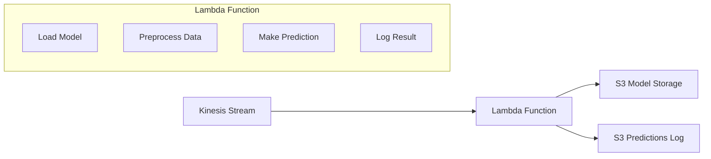

# Lambda Function - Real-time Inference Service

AWS Lambda function for real-time taxi trip duration prediction using XGBoost model.

## 🎯 Overview

This Lambda function processes streaming taxi ride events from Kinesis, loads a pre-trained XGBoost model from S3, makes predictions, and logs results back to S3. It's designed for serverless, scalable real-time inference.

## 📁 Contents

- **lambda_function.py**: Main Lambda handler with prediction logic
- **Dockerfile**: Container configuration for Lambda deployment
- **requirements.txt**: Python dependencies

## 🏗️ Architecture



## ⚡ Key Features

### Model Management
- **Cold Start Optimization**: Models cached globally to minimize cold start latency
- **S3 Model Loading**: Loads XGBoost model and DictVectorizer from S3
- **Error Handling**: Graceful degradation with default predictions on model load failures

### Data Processing
- **Feature Engineering**: Matches training pipeline preprocessing exactly
- **Input Validation**: Handles missing or invalid input data gracefully
- **Kinesis Integration**: Processes base64-encoded Kinesis records

### Prediction Logging
- **S3 Logging**: All predictions logged to S3 with date partitioning
- **Structured Output**: JSON format with metadata and timestamps
- **Audit Trail**: Complete prediction history for monitoring and analysis

## 🚀 Deployment

### Container-based Deployment (Recommended)
The function is deployed as a Docker container to AWS Lambda, providing:
- **Large Package Support**: Up to 10GB vs 250MB for zip deployment
- **Consistent Environment**: Same container for development and production
- **Better Dependencies**: Full control over runtime environment

```bash
# Build and deploy
cd ../scripts
./build_lambda.sh
```

### Manual Deployment
```bash
# Build Docker image
docker build -t lambda-function .

# Tag for ECR
docker tag lambda-function:latest [ECR_URI]:latest

# Push to ECR
docker push [ECR_URI]:latest
```

## 🔧 Configuration

### Environment Variables
- `DATA_STORAGE_BUCKET`: S3 bucket for model storage (default: mlops-taxi-prediction-data-storage-dev)
- `MODEL_S3_KEY`: S3 key for model file (default: models/latest/combined_model.pkl)
- `PREDICTIONS_S3_BUCKET`: S3 bucket for prediction logs

### Model Format
Expected model structure in S3:
```python
{
    'model': xgboost_model,        # Trained XGBoost model
    'vectorizer': dict_vectorizer   # Fitted DictVectorizer
}
```

### Input Format
Expected Kinesis event format:
```json
{
    "ride_id": "optional_ride_id",
    "PULocationID": 161,
    "DOLocationID": 236,
    "trip_distance": 2.5
}
```

### Output Format
Prediction logs in S3:
```json
{
    "ride_id": "ride_20230804_123456_789012",
    "timestamp": "2023-08-04T12:34:56.789Z",
    "features": {
        "PULocationID": "161",
        "DOLocationID": "236", 
        "trip_distance": 2.5
    },
    "predicted_duration": 15.32
}
```

## 🔍 Function Logic

### 1. Model Loading
```python
def load_model():
    # Load combined model and vectorizer from S3
    # Cache globally to avoid repeated loads
    # Handle errors gracefully
```

### 2. Data Preprocessing
```python
def preprocess_ride(ride_data):
    # Extract required features: PULocationID, DOLocationID, trip_distance
    # Convert to string format to match training pipeline
    # Handle missing values with defaults
```

### 3. Prediction
```python
def predict_duration(features, model, vectorizer):
    # Transform features using DictVectorizer
    # Make prediction using XGBoost model
    # Return float prediction or default on error
```

### 4. Logging
```python
def log_prediction(ride_id, features, prediction):
    # Create structured log entry
    # Save to S3 with date partitioning
    # Handle S3 errors gracefully
```

## 📊 Performance Characteristics

### Cold Start
- **Model Loading**: ~2-5 seconds for typical model sizes
- **Container Init**: ~1-2 seconds for Lambda container startup
- **Optimization**: Models cached globally after first load

### Warm Execution
- **Processing Time**: ~10-50ms per record
- **Throughput**: Handles batch sizes up to 100 records
- **Memory Usage**: ~256-512MB depending on model size

### Scaling
- **Concurrent Executions**: Scales automatically with Kinesis shards
- **Batch Processing**: Processes multiple Kinesis records per invocation
- **Error Isolation**: Individual record failures don't affect batch

## 🔍 Monitoring

### CloudWatch Metrics
- **Duration**: Function execution time
- **Errors**: Failed invocations
- **Throttles**: Concurrent execution limits
- **Iterator Age**: Kinesis processing lag

### Custom Logging
```python
# Built-in logging for debugging
logger.info(f"Processing {len(event['Records'])} records")
logger.info(f"Processed ride {ride_id}: predicted duration = {prediction:.2f} minutes")
```

### S3 Audit Trail
All predictions logged to S3 with structure:
```
predictions/
├── 2023/08/04/
│   ├── ride_123.json
│   ├── ride_124.json
│   └── ...
├── 2023/08/05/
│   └── ...
```

## 🛠️ Development

### Local Testing
```python
# Test with sample event
from lambda_function import lambda_handler

sample_event = {
    'Records': [{
        'kinesis': {
            'data': base64.b64encode(json.dumps({
                'PULocationID': 161,
                'DOLocationID': 236,
                'trip_distance': 2.5
            }).encode()).decode()
        }
    }]
}

result = lambda_handler(sample_event, {})
```

### Dependencies
```txt
boto3==1.34.0
xgboost==1.7.3
scikit-learn==1.3.0
```

## ⚠️ Important Notes

### Model Compatibility
- Model must be trained with same feature engineering pipeline
- DictVectorizer must be fitted on same categorical encoding
- XGBoost version compatibility is critical

### Error Handling
- Function continues processing on individual record failures
- Default predictions (15.0 minutes) used when model fails
- All errors logged to CloudWatch for debugging

### Security
- Uses IAM roles for S3 and Kinesis access
- No hardcoded credentials in code
- Least privilege permissions recommended

## 🎯 Learning Focus

This Lambda function demonstrates:
- **Serverless ML Inference**: Real-time prediction without managing servers
- **Model Management**: Loading and caching ML models in serverless environment
- **Stream Processing**: Handling high-throughput event streams
- **Monitoring**: Comprehensive logging and observability

The implementation prioritizes simplicity and educational value while maintaining production-ready patterns.
